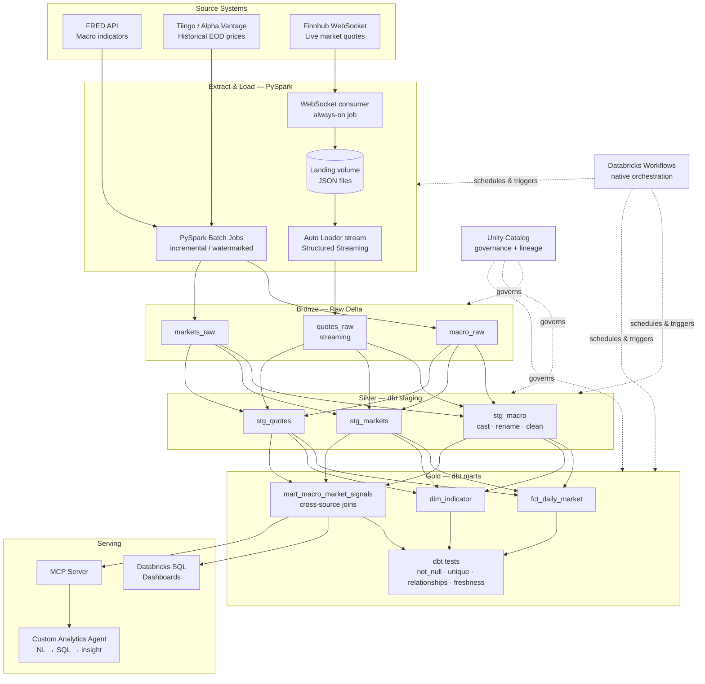

## 1. Executive Summary

I plan to make a production-style data platform that ingests U.S. **macroeconomic** and **financial-market** data into a **Databricks lakehouse**, transforms it through a medallion (Bronze → Silver → Gold) architecture, and exposes the curated data both to dashboards and to **AI agents through an MCP server**. It combines **batch** ingestion (macro indicators, historical prices) with **real-time streaming** (live market quotes), demonstrating the full modern data-engineering lifecycle on a big-data stack.

This project deliberately builds on the IS 566 final project (Snowflake + dbt + Prefect + Docker + a dbt MCP server over Adventure Works). It keeps the proven patterns I already know — medallion modeling in dbt, containerization, and agent-accessible data via MCP — while replacing the warehouse with a **Databricks lakehouse** and adding two net-new competencies: **PySpark / Spark Structured Streaming** and a **custom analytics agent** on top of MCP.

**The guiding question the platform answers:** *"How do financial markets respond to macroeconomic conditions?"* — e.g., correlating Treasury-yield and equity moves against CPI, unemployment, and Fed-rate releases, in near real time.

---

## 2. What This Demonstrates (Why It Matters)

This project is designed to prove I can independently:

- **Build a data warehouse / lakehouse** from raw sources into a governed, queryable serving layer.
- **Ingest data** at scale via both batch (PySpark) and streaming (Structured Streaming) paradigms.
- **Model and test data** with dbt for reliability, lineage, and documentation.
- **Orchestrate** a multi-stage pipeline natively with **Databricks Workflows** (multi-task jobs, scheduling, retries).
- **Connect AI to the warehouse** via MCP, and go further by building a **custom agent** that answers economic questions in natural language.
- **Apply agentic AI throughout the build** — using AI copilots to accelerate development, generate tests, and document decisions (a core theme of the mentorship course).

---

## 3. Architecture

**Caption:** FRED macro data and historical market prices are pulled by **PySpark batch jobs** into the Bronze Delta layer. Live quotes are handled in two hops, because Structured Streaming can't read a WebSocket directly: a small **always-on WebSocket consumer** subscribes to Finnhub and writes JSON files into a **landing volume**, and an **Auto Loader** Structured Streaming job incrementally ingests those files into Bronze. **dbt-databricks** transforms Bronze → Silver (staging) → Gold (marts) with automated tests. **Unity Catalog** governs the whole lakehouse and supplies lineage. **Databricks Workflows** orchestrates the batch multi-task job and runs the streaming job as its own always-on task. The curated Gold layer feeds Databricks SQL dashboards and an **MCP server**, which a **custom analytics agent** uses to answer economic questions in natural language.

---

## 4. Tech Stack

| Layer | Technology | Why (and how it builds on IS 566) |
|-------|-----------|-----------------------------------|
| **Lakehouse / Warehouse** | **Databricks + Delta Lake + Unity Catalog** | Net-new. Replaces Snowflake with an open lakehouse: ACID Delta tables, unified batch+streaming storage, and Unity Catalog for governance, lineage, and permissions. Free Edition is permanent-free and serverless. |
| **Batch ingestion** | **PySpark** | Net-new core skill. Distributed extract/transform of macro and historical market data. Reuses my IS 566 watermark/incremental pattern, now in Spark. |
| **Streaming ingestion** | **WebSocket consumer + Spark Structured Streaming + Auto Loader** | Net-new. A lightweight consumer lands live Finnhub quotes as JSON in a volume; Auto Loader incrementally streams them into Bronze — the biggest step up from the batch-only IS 566 pipeline. |
| **Transformation & modeling** | **dbt (dbt-databricks adapter)** | Reused strength. Silver/Gold models, tests, docs, and lineage — same discipline as IS 566, retargeted to Databricks SQL. |
| **Orchestration** | **Databricks Workflows** | Net-new (replaces Prefect). Native, in-workspace orchestration: multi-task jobs with dependencies, scheduling, retries, and a dbt task type — no external scheduler or extra infrastructure to run. |
| **Containerization** | **Docker Compose** | Reused. Runs the MCP server + analytics agent locally for reproducibility, exactly as containerization was used in IS 566. |
| **CI/CD** | **GitHub Actions** | Runs dbt build + tests on PRs; protects the Gold layer from breaking changes. |
| **Agent access** | **MCP server** | Reused concept, new depth. Exposes the lakehouse to AI agents (Databricks-managed MCP over Unity Catalog / Genie, or a custom FastMCP server). |
| **Custom AI layer** | **Analytics agent (NL → SQL → insight)** | Net-new. An agent that answers economic questions, runs governed queries through MCP, and generates written insights. |
| **Languages** | **Python, SQL** | Core throughout. |

---

## 5. Data Domain & Sources

The warehouse is built around a **macro + markets blend**: U.S. macroeconomic indicators joined against financial-market data, so the platform can quantify how markets move with the economy. All sources are free or low-cost.

| Source | Data | Ingestion | Tier / Cost | Role |
|--------|------|-----------|-------------|------|
| **FRED API** (St. Louis Fed) | 800k+ economic time series: GDP, CPI, unemployment, Fed Funds rate, Treasury yields, PMI, etc. | Batch (daily) | **Free** (120 req/min) | Macro backbone |
| **Tiingo** *(or Alpha Vantage)* | Historical end-of-day equity & ETF prices (30+ yrs), fundamentals | Batch (daily) | **Free** tier; small paid tier optional for more symbols | Market history |
| **Finnhub** | Live trade/quote stream for equities & ETFs (WebSocket) | **Streaming** (consumer → landing volume → Auto Loader) | **Free** (WebSocket, 60 calls/min); ~15-min delay on free | Real-time layer |
| **U.S. Treasury / FRED yields** | Daily Treasury yield curve | Batch | **Free** | Rate analytics |

**Illustrative analytical entities in the Gold layer:**

- `dim_indicator` — catalog of macro series (id, name, frequency, units, source).
- `fct_macro_observation` — time series of macro readings (indicator, date, value).
- `fct_daily_market` — daily OHLCV per symbol.
- `fct_intraday_quote` — streamed live quotes (symbol, price, volume, ts).
- `mart_macro_market_signals` — the flagship cross-source mart joining market moves to the nearest macro releases, with derived features (rolling volatility, correlation windows, surprise vs. prior).

**Example questions the platform can answer:**
- "How did the S&P 500 and 10-year yield move in the 5 days around the last three CPI releases?"
- "Which sectors are most correlated with changes in the unemployment rate this year?"
- "Show me live price action for bank-sector ETFs today against the latest Fed-rate expectation."

---

## 6. Milestones & Hour Budget (≈70 hours)

| # | Milestone | Key deliverables | Hours |
|---|-----------|------------------|------:|
| **M0** | **Environment & foundation** | Databricks workspace + Unity Catalog catalog/schemas; Git repo & branch strategy; Docker Compose skeleton; secrets management; API keys provisioned | **6** |
| **M1** | **Batch ingestion (PySpark)** | PySpark jobs pulling FRED macro + historical EOD prices into Bronze Delta; incremental/watermark logic; schema enforcement | **10** |
| **M2** | **Streaming ingestion** | Always-on WebSocket consumer landing Finnhub JSON to a volume; Auto Loader Structured Streaming job → Bronze; checkpointing; late-data handling | **12** |
| **M3** | **dbt modeling** | dbt-databricks project; Silver staging models (clean/cast/rename); Gold marts incl. `mart_macro_market_signals`; docs + lineage | **12** |
| **M4** | **Orchestration (Databricks Workflows)** | Multi-task Workflow (`ingest_fred → ingest_markets → dbt build → dbt test`) scheduled daily; streaming job as its own always-on task; task-level retries | **4** |
| **M5** | **Data quality & observability** | dbt tests (not_null/unique/relationships/freshness); source freshness SLAs; Unity Catalog lineage review; CI on PRs | **6** |
| **M6** | **MCP + custom analytics agent** | MCP server over the lakehouse; custom agent doing NL → governed SQL → written insight; guardrails | **10** |
| **M7** | **Serving, docs & demo** | Databricks SQL dashboard; README + `technical_decisions.md`; architecture diagram; recorded demo | **6** |
| **M8** | **Buffer / polish / testing** | End-to-end test run, bug fixes, cost cleanup, final review | **4** |
| | **Total** | | **70** |

> Hours are planning estimates. Cutting a separate orchestrator (native Workflows instead of an external scheduler) reinvests time into the two differentiators — streaming (M2) and the agent (M6). If streaming (M2) runs long, the M8 buffer absorbs it and the agent (M6) can ship a narrower first scope (query + summarize) with insight-generation as stretch.

---

## 7. Learning Outcomes

By completion I will have demonstrably:

1. Stood up and governed a **Databricks lakehouse** with Unity Catalog.
2. Written **PySpark** batch jobs with incremental/watermark ingestion.
3. Built a **Spark Structured Streaming** pipeline (WebSocket consumer → landing volume → Auto Loader) with checkpointing and late-data handling.
4. Modeled a medallion warehouse in **dbt-databricks** with automated testing, lineage, and docs.
5. Orchestrated a production pipeline natively with **Databricks Workflows** (multi-task jobs, scheduling, retries).
6. Implemented **CI/CD** that protects a serving layer from breaking changes.
7. Exposed governed data to AI via an **MCP server** and built a **custom analytics agent** on top of it.
8. Used **agentic AI** as a development accelerator throughout, and documented where it helped and where it didn't.

---

## 8. Deliverables

- A working, reproducible repository (Docker-composed) with the full pipeline.
- Bronze/Silver/Gold Delta tables in Unity Catalog with dbt tests passing.
- A live streaming job and a scheduled multi-task Workflow.
- An MCP server + custom analytics agent demoable against real questions.
- A Databricks SQL dashboard.
- Documentation: this spec, a `technical_decisions.md`, an architecture diagram, and a short recorded demo.

---

## 9. Scope Boundaries & Risks

**In scope:** batch + streaming ingestion, medallion modeling, orchestration, data quality, MCP + agent, one dashboard.

**Out of scope (future work):** ML forecasting models, multi-region deployment, production alerting/on-call, and a full BI suite. These are noted as extensions, not commitments.

**Key risks & mitigations:**
- *Databricks Free Edition compute limits* (serverless-only, capped concurrency). → Keep clusters small; orchestrating with native Workflows keeps everything in-workspace, so the graded pipeline needs no account-level APIs. Reserve the paid budget only for the optional managed-MCP path (M6) if I choose it. (Detailed in the private implementation guide.)
- *Streaming complexity* is the highest-risk milestone. → Start with a micro-batch trigger and a small symbol set; scale only after it's stable.
- *API rate limits.* → Reuse the IS 566 watermark pattern and cache; stay within FRED (120/min) and Finnhub (60/min) limits.
- *70-hour fit.* → M8 buffer plus a defined "narrow first version" of the agent protect the timeline.

---

## 10. Relationship to IS 566

| IS 566 | This project |
|----------------|-----------------------|
| Snowflake warehouse | Databricks lakehouse + Delta + Unity Catalog |
| Python custom ETL | PySpark batch + Structured Streaming |
| Prefect | Databricks Workflows |
| dbt (Snowflake) | dbt (Databricks adapter) |
| Docker | Docker (retained) |
| dbt MCP server | MCP server **+ custom analytics agent** |
| Batch only | **Batch + real-time streaming** |
| Adventure Works retail data | **Macro + financial-market data** |

This project keeps everything that worked in IS 566 and goes deep on the skills most requested in modern data-engineering roles: **Spark, real-time streaming, and agentic AI** — doing a few things really well rather than spreading thin.

---

*Sources for platform/API facts are compiled in the companion implementation guide.*
