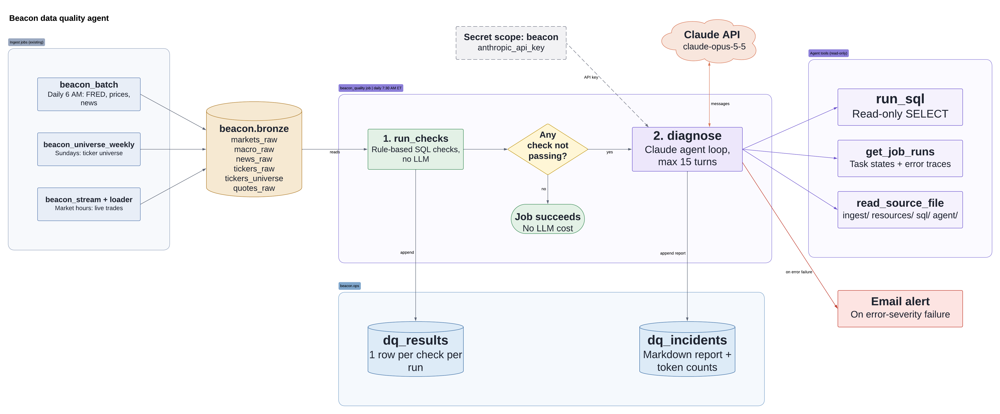
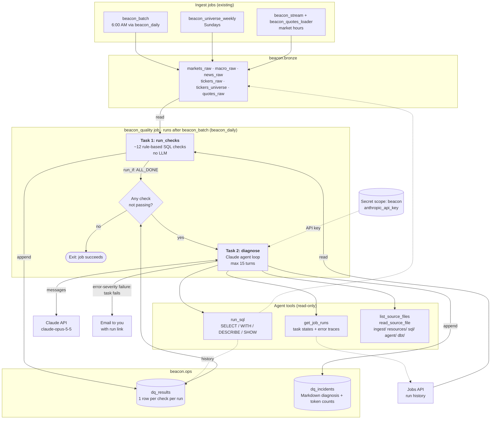

# Beacon data quality agent

A Databricks job (`resources/beacon_quality.job.yml`) that `beacon_daily` starts right after `beacon_batch` finishes, whether ingest succeeded or failed. It has two tasks:

1. **`run_checks`** ([run_checks.py](run_checks.py)) runs the rule-based checks in [checks.py](checks.py) and appends one row per check to `beacon.ops.dq_results`. It doesn't call an LLM.
2. **`diagnose`** ([diagnose.py](diagnose.py)) does nothing if every check passed. Otherwise it gives the failures to Claude along with read-only tools (`run_sql`, `get_job_runs`, `list_source_files`, `read_source_file`) and saves the Markdown diagnosis to `beacon.ops.dq_incidents`. The task fails if any `error`-severity check failed, which sends you an email.

All thresholds are in [config.py](config.py).

## How it fits together



Source diagram: [Lucidchart](https://lucid.app/lucidchart/069ed939-8cfc-4530-a2d5-846bc5a27720/edit). To update the image, edit it there, export the page as PNG, and replace `diagram.png`.

<details>
<summary>Text version (Mermaid)</summary>



</details>

**Layer 1 (rule-based checks)** runs every day and costs nothing beyond compute. **Layer 2 (the agent)** only runs when something fails. The agent can query data, look at job runs and read code, but it can't change anything. Its output is a report for you to act on.

## Checks

| Check | Table | Severity | Fails when |
|---|---|---|---|
| `markets_freshness` | markets_raw | error | A watchlist symbol is missing or more than 4 days behind |
| `markets_duplicates` | markets_raw | error | Any `(symbol, obs_date)` appears twice |
| `markets_ohlc_sanity` | markets_raw | error | In the last 30 days: high < low, close or open outside the range, price <= 0 |
| `markets_adj_jump` | markets_raw | warn | `adj_close` moves more than 15% in a day with no split |
| `macro_freshness` | macro_raw | error | A series is older than its limit (daily 7d, monthly 100d, GDP 200d) |
| `macro_integrity` | macro_raw | error | Duplicate keys or null values |
| `news_freshness` | news_raw | error | Newest article is more than 72h old (off: `NEWS_CHECK_ENABLED = False`) |
| `news_duplicates` | news_raw | error | Duplicate `article_id` (off: `NEWS_CHECK_ENABLED = False`) |
| `quotes_last_session` | quotes_raw | warn | Fewer than 1,000 trades, or a symbol is missing, on the last trading day |
| `tickers_refresh` | tickers_raw | error | Not 9 rows, or not loaded in 2 days |
| `universe_refresh` | tickers_universe | error | Fewer than 50k rows, or not loaded in 9 days |
| `job_runs:<job>` | jobs | error | The latest run of `beacon_batch` or `beacon_universe_weekly` failed or is too old |

## Setup

See the setup steps in the PR or conversation that added this folder. In short:

```bash
databricks secrets put-secret beacon anthropic_api_key --profile DEFAULT
databricks bundle deploy -t dev --profile DEFAULT
databricks bundle run beacon_quality -t dev --profile DEFAULT
```

## Reading results

```sql
-- Today's check results
SELECT check_name, severity, status, message
FROM beacon.ops.dq_results
WHERE run_id = (SELECT max_by(run_id, check_ts) FROM beacon.ops.dq_results)
ORDER BY status DESC, check_name;

-- Latest diagnosis
SELECT created_ts, failed_checks, report
FROM beacon.ops.dq_incidents
ORDER BY created_ts DESC LIMIT 1;

-- Pass rate per check over the last 30 days
SELECT check_name, avg(CASE WHEN status = 'pass' THEN 1 ELSE 0 END) AS pass_rate
FROM beacon.ops.dq_results
WHERE check_ts >= current_date() - INTERVAL 30 DAYS
GROUP BY check_name ORDER BY pass_rate;
```

## Adding a check

Write a function in `checks.py` decorated with `@check` that returns a list of `Result`. It runs on the next job run and needs no other wiring.

## Safety notes

- The agent's SQL is limited to one `SELECT`/`WITH`/`DESCRIBE`/`SHOW` statement, and a keyword denylist blocks writes. This is a guard, not a permission boundary. The job runs as you, so for real isolation run it as a service principal that only has `SELECT` on `beacon.bronze` and `beacon.ops`.
- `read_source_file` can only read files under `ingest/`, `resources/`, `sql/`, `agent/` and `dbt/`. It can't read `.env`.
- Cost: the agent only runs on days with failures. It uses `claude-opus-5-5` at `medium` effort, capped at 15 turns per run. Token counts are stored in `dq_incidents`.
- Server-side refusal fallback (`fallbacks="default"`) is turned on. If a run reports `TypeError ... fallbacks`, the installed `anthropic` package is too old for that parameter.
